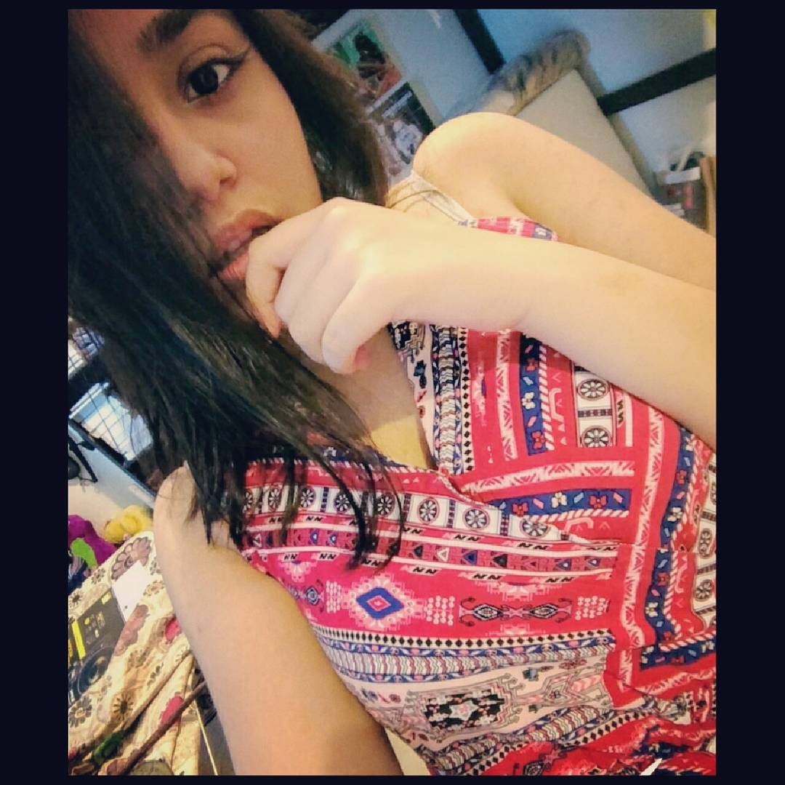

# C++ Game Text Adventure RETRO-MODE

### TO DO LIST

- [x] Simple Front-End
- [ ] Connection to DB
- [ ] DB Options SCRUD or CRUD (Search Create Read Update Delete) 
- [ ] Game 

- [ ] Improve Design 

### Author

<table id='tabI' border="0" style="width:100%;border:0px;" >
  <tr>
    <th>Joao Maia</th>
    <th>Diogo</th> 
    <th>Mariya</th>
    <th>Someone 1</th>
    <th>Someone 2</th>
  </tr>
  <tr>
    <td></td>
    <td></td>
    <td></td>
    <td></td>
    <td></td>
  </tr>

</table>

