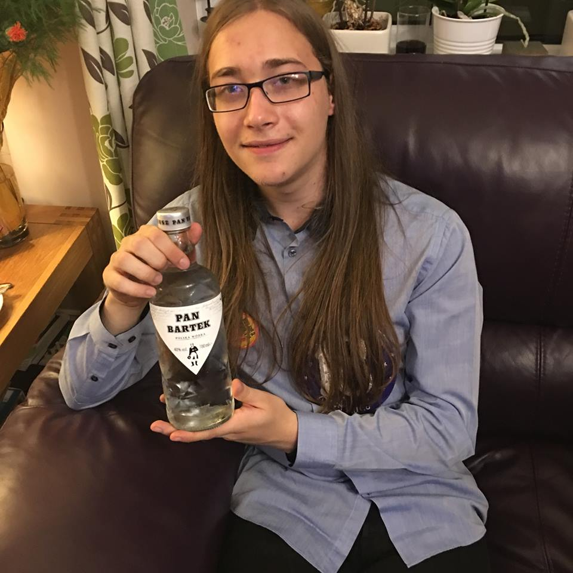
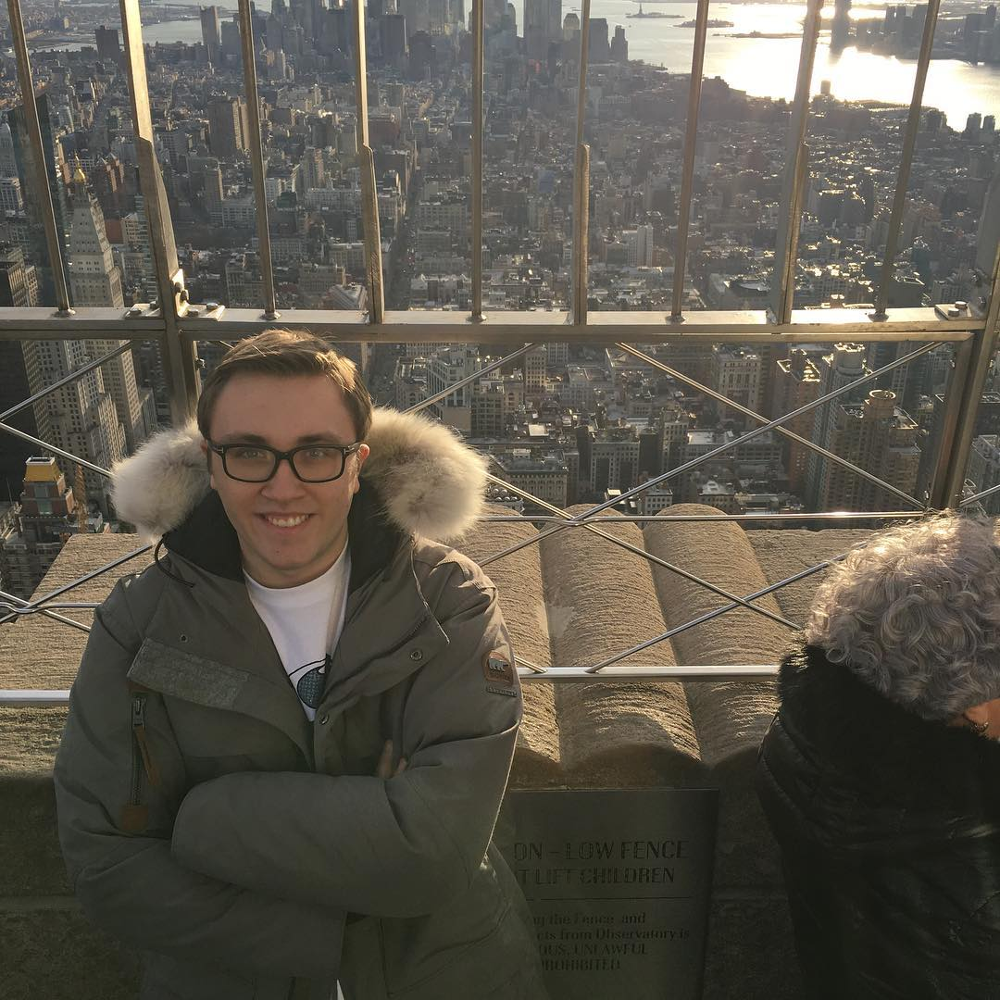

# C++ :sunny: Game Text Adventure CONSOLE-MODE :four_leaf_clover:
### Manual c++ -> https://github.com/fffaraz/awesome-cpp 

## Need TO install on linux:

###### :exclamation: Running random scripts off the internet is generally a bad idea!
 __Install C++ compiler/librarys on linux using a script__ Script provided by David Croft (Coventry University Tutor)
 >  __wget https://git.io/vF0E1 -O - | sudo bash__  (Script)  
:cop: __sudo apt-get install libncursesw5-dev__  :exclamation: (Curses Library with Unicode/ASCII small support)  
:cop: __sudo apt install libsqlite3-dev__   (SQLite Library)

## :exclamation: REMEMBER TO BE ON THE CORRECT FOLDER FRIST :stuck_out_tongue_winking_eye:
---
### :thumbsup: Useful Commands:

#### EASY INSTALL:
> __make -f first_step__
###### this will load first_step file inside folder as a makefile
#### :ghost: Easy compile(load script):  
> __"make"__  
###### this will load makefile inside folder

#### :kissing_heart: to compile -> 
> __"g++ -std=c++14 main.cpp -lsqlite3 -lncursesw -o game"__  
###### after -o put the name you want to give to the executable, my case i choose 'game' -l means library to load sqlite3 (database) ncurses( is "canvas"(pointers) for console)

#### :sleepy: execute ->    
> __"./<name inputed after -o>"__

---
### If same functions on the game dont work you need to give full permission to the files/folder

__"sudo chmod -R 755"__

### :bust_in_silhouette: Github commands:
###### config your console with yout github account
> git config --global user.email "<uni email>"
> git config --global user.name "<uni email without @uni.coventry.ac.uk>"
---
> git add <name file to add (your file(s) )  
> git commit -m "<text, try write something about you have done(Good pratice)>"
git push

### BUGS FOUND

> - [x] REAL BUG FROM bind() -> DONT ACCEPT 2 binds() with a Operation (AND,OR,BETWEEN,etc)
> - [x] Fast SOLUTION -> Use transform2Quote/Inserto into string function (bad pratice!)

---

### TO DO LIST

###### Ideia for game-dev
> - [x] Use cordenates like [x,y] on the floor and z to indicate the floor ,Player start on 0,0,0 Up and Down (Floors), North(+y) , South(-y) , West(-x) , East(+x) , [-1,-1,z] unvaiable in all floors, when reach [x,y,z] position, that means a room, only on door location is posible to enter and LOOK for items after find n items can go up 
> - [ ] :exclamation:__Game Name__ *Mariya & Iqra*
> - [ ] :exclamation:__Game History__ *Luke*
> - [x] Simple Design
> - [ ] __Better Design__
> - [x] DB Creaction
> - [x] DB Items
> - [x] Connection to DB
> - [x] DB Options SCRUD or CRUD (Search Create Read Update Delete)
> - [x] Ranking
> - [ ] __Ranking DESIGN NEED IMPROVE__
> - [x] Organize functions , create better algorithm, kinda like MVC design 
> - [x] addScore(user,score2add)
> - [x] upLevel(user,xLevels)
> - [x] haveItem(user,item)
> - [x] Go back if wanted(Struct algorithm/Menus)
> - [x] Player info travel between cpp&&headers 

> - [x] Game - GAME IDEIA  ()
> - [ ] :herb: __Game - Children     (Floor 3)__ :boom: *Joao*
> - [ ] MAP(ROOMS)   
> - [ ] STORY   
> - [ ] STORY MAPPED 
> - [ ] :herb: __Game - Surgery      (Floor 2)__ :boom: *Diogo*
> - [ ] MAP(ROOMS)   
> - [ ] STORY  
> - [ ] STORY MAPPED 
> - [ ] :herb: __Game - Psychiatric  (Floor 1)__ :boom: *Luke*
> - [ ] MAP(ROOMS)   
> - [ ] STORY   
> - [ ] STORY MAPPED 
> - [ ] :herb: __Game - Lobby        (Floor 0)__ :boom: *Diogo*
> - [ ] MAP(ROOMS)   
> - [ ] STORY   
> - [ ] STORY MAPPED 
> - [x] Game - After found key do the maze to finish the game
> - [ ] __Game - Algorithm for maze creation (to be diferent each time start an final level)__ :boom: *Bartek*
> - [x] Game - Congratz after finish maze with Player Info 
> - [ ] :herb:  __Game - Basement     (Floor -1)__ :boom: *Mariya*
> - [ ] MAP(ROOMS)   
> - [ ] STORY   
> - [ ] STORY MAPPED 
> - [ ] :herb: Game - __Credit area__ :boom: *Iqra*
> - [ ] :herb: Game - __Review all stuff(Check comments on code)__

:exclamation: :exclamation: Important for IPP/Viva :computer:
> - [ ] :warning: __Flow Diagram(Code)__ :japanese_goblin: Individual
> - [ ] :warning: __ER Diagram(DB)__ :japanese_goblin: Individual
> - [ ] Screenshots of runtime game :japanese_goblin: Individual

### ESSENCIAL(To achive high mark)
- [ ] GUI *Joao*

### EXTRA 

- [ ] Improve Design (COLORS,etc.)

### Author

| [Joao Maia   (Leader)](https://github.coventry.ac.uk/deoiveij/)                           | [Diogo](https://github.coventry.ac.uk/vicented)                                        | [Mariya](https://github.coventry.ac.uk/lokhandm)         | [Bartek]()       | [Iqra](https://github.coventry.ac.uk/khani54)         | [Luke](https://github.coventry.ac.uk/rompls)          |
| :---:                                           |     :---:                                    |     :---:      |         :---: |         :---: |    :---:      |
|                                                 |                                              |                |               |               |               |
| |  |                |     |  |               |

<!--
<table>
  <tr style="background-color:yellowgreen;color:white;">
    <th ></th>
    <th ></th> 
    <th ></th>
    <th ></th>
    <th ></th>
    <th ></th>
  </tr>
  <tr>
    <td></td>
    <td></td>
    <td></td>
    <td></td>
    <td></td>
    <td></td>
  </tr>

</table>
-->